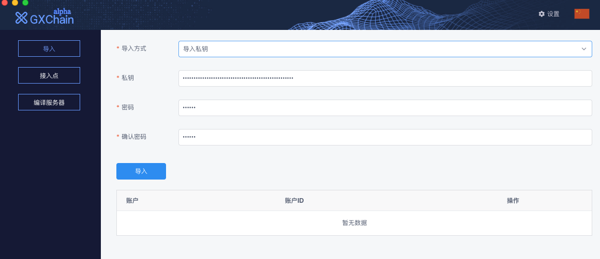
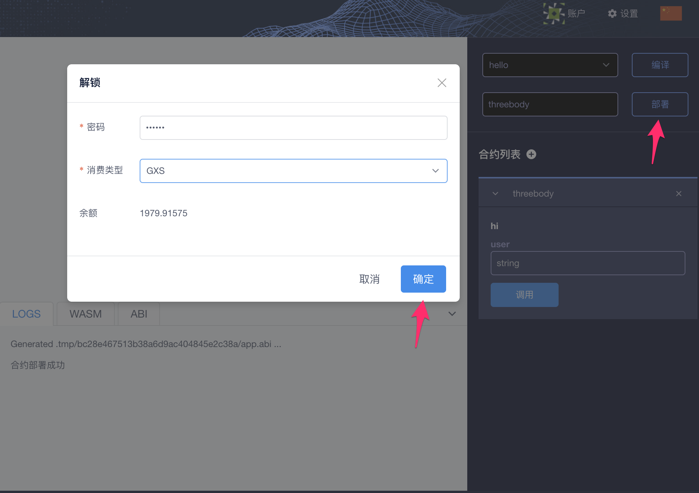

#  Getting started with Smart Contract(TestNet)

## Introduction

GXChain smart contract 2.0, on the basis of WebAssembly virtual machine, currently supports C++. Developers write smart contracts in C++, compile the code into WebAssembly (also known as WASM) through LLVM, deploy it to the blockchain, and interact with smart contracts through the Application Binary Interface (ABI).

### Documents

| Documentation | Link |
| :-- | :-- |
| Build-in APIs | [gxb_contract_api.md](https://github.com/gxchain/Technical-Documents/blob/master/gxb_contract_api.md) |
| Contract Storage | [contract_storage_usage.md](https://github.com/gxchain/Technical-Documents/blob/master/contract/contract_storage_usage.md) |

### Examples

| Example | Link |
| :-- | :-- |
| helloworld | [/contracts/examples/helloworld](https://github.com/gxchain/gxb-core/tree/dev_master/contracts/examples/helloworld) |
| bank | [/contracts/examples/bank](https://github.com/gxchain/gxb-core/tree/dev_master/contracts/examples/bank) |
| redpacket | [/contracts/examples/redpacket](https://github.com/gxchain/gxb-core/tree/dev_master/contracts/examples/redpacket) |
| linear_vesting_asset | [/contracts/examples/linear_vesting_asset](https://github.com/gxchain/gxb-core/tree/dev_master/contracts/examples/linear_vesting_asset) |
| riddle | [/contracts/examples/riddle](https://github.com/gxchain/gxb-core/tree/dev_master/contracts/examples/riddle) |

Two ways to experience smart contracts: smart contract IDE and cli_wallet
## Quick Start(IDE)

### 1. Register an Account

Visit [Online Wallet](https://testnet.wallet.gxchain.org/#/) to register wallet account

### 2. Apply Token on Testnet

Finish registration and apply token on [TestNet](http://blockcity.mikecrm.com/2SVDb67)

### 3. Download IDE

Smart contract IDE allows you to write, compile, deploy, and invoke smart contracts. [Click to download](https://github.com/gxchain/gxchain-alpha/releases/latest)

### 4.Import Account

Go to [Online Wallet](https://testnet.wallet.gxchain.org/#/) in step 1 to find your private key


Open client, enter setting page and import account

::: warning Note
Password would not be uploaded to server, if you forgot the password, remove the wallet then try to import private key again.
:::



#### 5.Select a template


#### 6.Compile


#### 7.Deploy

The wallet needs to be unlocked before deployment




#### 8.Invoke

The wallet needs to be unlocked


## Quick Start(Cli)

### 1. Install

If you do not want to use smart contract IDE or want to build a more stable and reliable compilation environment; GXChain program can be compiled locally, and smart contracts can be compiled, deployed, and invoked via the command line. GXChain source compilation, currently support ubuntu and MAC systems:

- [Build on Ubuntu](https://github.com/gxchain/gxb-core/wiki/BUILD_UBUNTU)
- [Build on OS X](https://github.com/gxchain/gxb-core/wiki/BUILD_OS_X)

### 2. Create a contract

Use the `gxx` template to create a helloworld contract

```
gxx -n helloworld
```

### 3. Compile

Compile the contract to generate the wast and wasm files

``` bash
gxx -o helloworld/helloworld.wast helloworld/helloworld.cpp
```
Generate abi file

``` bash
gxx -g helloworld/helloworld.abi helloworld/helloworld.cpp
```

### 4. Deploy

You need to open cli_wallet, connect to local or remote testnet nodes

``` bash
./programs/cli_wallet/cli_wallet -swss://testnet.gxchain.org --chain-id c2af30ef9340ff81fd61654295e98a1ff04b23189748f86727d0b26b40bb0ff4
```

Import your private key

``` bash
# setup a password for your wallet if neededm, eg.mylocalpassword

new >>> set_password mylocalpassword

# unlock the wallet
locked >>> unlock mylocalpassword

# Import your private key
unlocked >>> import_key your_account_name your_private_key

# Deploy contract, name it helloworld，using account your_accoutn_name， vm_type=0 vm_version=0，the path of wast/abi is ./helloworld , using GXS as fee payment
unlocked >>> deploy_contract helloworld your_account_name 0 0 ./helloworld GXS true
```

### 5. Invoke
Once the deployment contract is successful, you can query the contract using the get_account interface

``` bash
unlocked >>> call_contract nathan helloworld null hi "{\"user\":\"zhuliting\"}" GXS true
```

## Other
### 1. Setup Testnet

refer to [Testnet](testnet.html)

### 2. About GXX-Server

refer to [gxchain/gxx-server](https://github.com/gxchain/gxx-server)

### 3. Basic types in smart contract

::: warning
Currently the Multi-Index table only supports：int128, int256, float, double
:::
