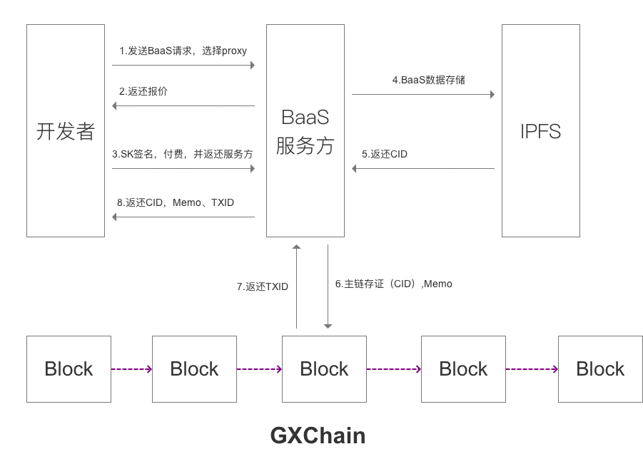

# BaaS存储API介绍

本文档介绍了如何快速调用公信宝BaaS 存储API，适用于API开发者，需要一定的编程基础。因主链存在存储空间大小的限制，我们的解决方法是将文件本体存储在侧链（IPFS）上，将侧链产生的文件C-ID返还至主链进行存证。在主链上保存的C-ID和时间戳可以保证上链数据不可篡改的基本原则。



## 1. 创建帐户

首先，你需要拥有一个公信宝钱包帐户，用于调用 BaaS存储服务时，支付存储费用并在区块链上记帐。

如果已经拥有公信宝钱包帐户，可以跳过此步骤。

如果还没有公信宝钱包帐户，可以通过手机钱包、网页钱包创建帐户。

PC端钱包/网页钱包使用教程:

1. 注册和备份教程：[http://mp.weixin.qq.com/s/eNQyqY5dyaP299J5qra0Bg](http://mp.weixin.qq.com/s/eNQyqY5dyaP299J5qra0Bg)
2. 恢复和导入教程：[http://mp.weixin.qq.com/s/27v540tvhfDHF6Bv5\_ObKQ](http://mp.weixin.qq.com/s/27v540tvhfDHF6Bv5_ObKQ)

手机钱包教程：[https://forum.gxb.io/topic/130/gxs-移动端钱包发布-说明文档-ios审核已通过](https://forum.gxb.io/topic/130/gxs-移动端钱包发布-说明文档-ios审核已通过)

## 2. 导出私钥

从手机钱包或者网页钱包导出帐户的活跃权限私钥，供后面调用SDK时使用。

## 3. BaaS存储服务地址

* 线上正式地址:  `https://baas.gxchain.cn/api/storage`
* 线上开发者测试地址: `https://baas-developer.gxchain.cn/api/storage`

## 4. 如何调用SDK

SDK提供了和BaaS存储服务交互的方法封装。目前暂时提供Java版本的SDK，后续会支持多种语言。

### Java - maven

* maven仓库地址\(HTML View\): `https://repo.gxchain.cn/service/rest/repository/browse/maven-public/`
* maven仓库引入地址: `https://repo.gxchain.cn/repository/maven-public/`

::: warning 提示
如果无法引入包，请将https更换成http尝试一下
:::

#### maven setting.xml

```xml
<mirror>
    <id>gxchain</id>
    <mirrorOf>*</mirrorOf>
    <url>http://repo.gxchain.cn/repository/maven-public/</url>
</mirror>
```

#### pom dependency

```xml
<dependency>
    <groupId>com.gxb.block.baas</groupId>
    <artifactId>baas-sdk-client</artifactId>
    <version>1.0.2-RELEASE</version>
</dependency>
```

### Node - npm

`npm install baas-sdk-node`

## 5. BaaS存储服务API接口

| 接口 | 描述 |
| :--- | :--- |
| [provider](#provider接口) | 获取服务提供方信息 |
| [store](#store接口) | 数据存储接口 |
| [data](#data接口) | 获取数据接口，根据cid获取数据 |

### provider接口

通过指定路径获取服务方提供的信息

- 请求地址

GET /provider

- 请求参数
无

- 例子（以curl为例）
```sh
curl https://baas.gxchain.cn/api/storage/provider
```

- 响应返回

```js
{
    "code":200,
    "msg":"ok",
    "data":{
        "account_id":"1.2.639287", // 提供方正式环境baas account id
        "name":"GXChain Official BaaS Storage",
        "description":"公信宝BaaS存储+存证服务",
        "fees":[ // 支持的支付资产类型以及费率
            {"fee_per_kbytes": 20, "asset_id":"1.3.1"}
        ]
    }
}
```

- SDK示例-JAVA

```java
return new BaasDefaultClient(URL_HEADER + "storage/provider").execute(new ProviderReq());
```

可参考**com.gxb.block.baas.sdk.client.api.BaasConstants**类


### store接口

调用方通过该接口可把自己的数据通过baas平台服务有偿上链。

- 请求地址

POST /store

Content-Type= **multipart/form-data**

- 请求参数

| 参数 | 类型 | 必填 | 最大长度 | 描述 | 示例 |
| --- | --- | --- | --- | --- | --- |
| data | byte/File | Y | 不超过10MB | 要存储的原始数据 | 12345678asdfg\(\)\_:&lt;&gt;!@\#$%^&\*=-';\" ' |

说明：
- 存储固定消耗GXS，最小单位为 0.0002/kb.
- 数据大小限制后续会放开

- 响应参数

| 参数 | 类型 | 是否必填 | 最大长度 | 描述 | 示例 |
| --- | --- | --- | --- | --- | --- |
| txid | String | Y | 64 | 区块交易ID | d4763fd0d802473579ae2dcaa2c6707adf4f2e7e |
| cid | String | Y | 64 | IPFS存储的CID值 | QmaZrwThXyZm8Rxs93Tih3L6p4Q8NqYEXp32iN4PeAqDgv |

例子

```js
{
    "code":200,
    "msg":"ok",
    "data":{
        "cid":"QmaZrwThXyZm8Rxs93Tih3L6p4Q8NqYEXp32iN4PeAqDgv",
        "txid":"d4763fd0d802473579ae2dcaa2c6707adf4f2e7e"
    }
}
```

- SDK示例-JAVA

```java
// build store client
// EXAMPLE_ACCOUNT is your account id
// EXAMPLE_PRIVATE_KEY is your account private key
// EXAMPLE_PUBLIC_KEY is your account public key
// * Attention: Your EXAMPLE_PRIVATE_KEY and EXAMPLE_PUBLIC_KEY can not be uploaded.
StoreClient client = new StoreClient(EXAMPLE_ACCOUNT, EXAMPLE_PRIVATE_KEY, EXAMPLE_PUBLIC_KEY);
// response
StoreDataResp resp = client.store("Hello World!".getBytes());
```

```
具体参照 com.gxb.block.baas.sdk.client.api.client.StoreClient
```
线上帐户的id, 帐户活跃权限公钥可以在公信宝区块浏览器上根据帐户名获得：

区块浏览器地址: [https://block.gxb.io/#/](https://block.gxb.io/#/)

**也可以通过[provider接口](#provider接口)接口获取到线上正式环境与开发者测试环境对应的BaaS账户id**

```js
# 以帐户名gxs-dev为例，params传入帐户名
curl --data '{"jsonrpc": "2.0", "method": "get_account_by_name", "params": ["gxs-dev"], "id": 1}' https://node1.gxb.io

# 响应
{
    "id": 1,
    "jsonrpc": "2.0",
    "result": {
        "id": "1.2.639290",  // 帐户id
        "membership_expiration_date": "1970-01-01T00:00:00",
...
...
        "lifetime_referrer_fee_percentage": 3000,
        "referrer_rewards_percentage": 0,
        "name": "gxs-dev",  // 帐户名
        "owner": {
            "weight_threshold": 1,
            "account_auths": [],
            "key_auths": [
                ["GXC85WbsFPSRjRto4n4gbopwGBEf41iroDesrNxN1WXJLTb9Mv2sc", 1]
            ],
            "address_auths": []
        },
        "active": { // 活跃权限
            "weight_threshold": 1,
            "account_auths": [],
            "key_auths": [
                ["GXC7xQNvkevq5fkCZPfi7rLTXZb1WKfE41sDTxqf7xUg36BLbZLvh", 1] // 活跃权限公钥
            ],
            "address_auths": []
        },
...
...
    }
}
```

- 错误情况

| code | msg | 描述 |
| --- | --- | --- |
| 401 | DATA\_SIGN\_FAILURE | 验签失败 |
| 402 | BALANCE\_NO\_ENOUGH | 账户余额不足 |
| 404 | REQ\_EXPIRATION | 请求过期 |
| 405 | DATA\_MD5\_INVALID | 数据MD5不通过 |
| 406 | ACCOUNT\_NO\_EXIT | 账户不存在 |
| 407 | DATA\_OVER\_SIZE | 数据长度过长 |
| 408 | AMOUNT\_INVALID | 金额不合要求 |


### data接口

通过Cid值获取对应存的数据

- 请求地址

GET /data/{cid}

- 请求参数

| 参数 | 类型 | 必填 | 最大长度 | 描述 | 示例 |
| --- | --- | --- | --- | --- | --- |
| cid | String | Y | 64 | 存储数据的Cid值 | QmaZrwThXyZm8Rxs93Tih3L6p4Q8NqYEXp32iN4PeAqDgv |

例子：

```js
GET /api/data/QmaZrwThXyZm8Rxs93Tih3L6p4Q8NqYEXp32iN4PeAqDgv
```

- 响应返回

返回一个 QmaZrwThXyZm8Rxs93Tih3L6p4Q8NqYEXp32iN4PeAqDgv.baas 的文件

- SDK示例-JAVA

```java
// build store client
// EXAMPLE_ACCOUNT is your account id
// EXAMPLE_PRIVATE_KEY is your account private key
// EXAMPLE_PUBLIC_KEY is your account public key
// * Attention: Your EXAMPLE_PRIVATE_KEY and EXAMPLE_PUBLIC_KEY can not be uploaded.
StoreClient client = new StoreClient(EXAMPLE_ACCOUNT, EXAMPLE_PRIVATE_KEY, EXAMPLE_PUBLIC_KEY, false);
// byte[]
byte[] result = client.getRawBytes(CID);
// String
String str = client.getRawString(CID);
// File
String file = client.downloadFile(CID,TARGET_FILE); // TARGET_FILE is java.io.File.
```

- 错误情况

| code | msg | 描述 |
| --- | --- | --- |
| 401 | NO\_EXIT | 不存在 |

