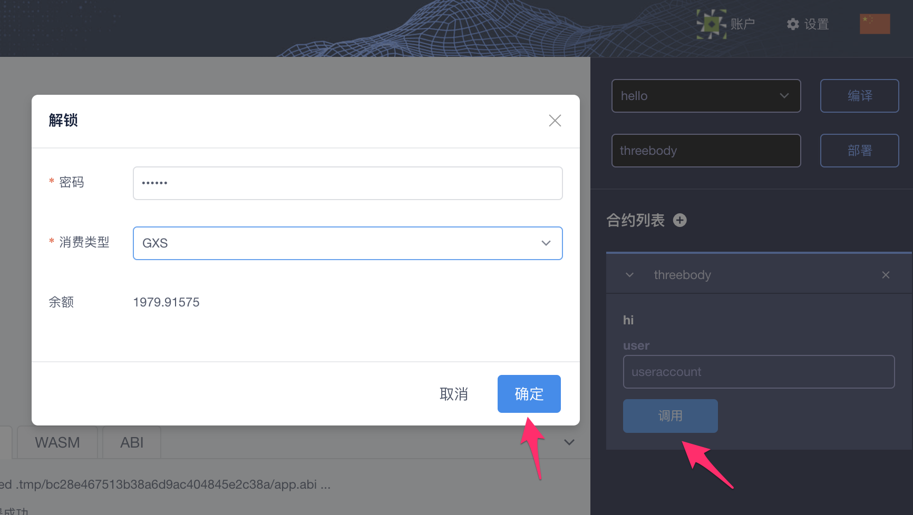

#  智能合约快速开始(TestNet)

## 介绍

GXChain智能合约2.0，底层使用WebAssembly虚拟机，目前支持C++语言的智能合约编写。
开发者使用C++编写智能合约，通过llvm将代码编译成WebAssembly（又名WASM），部署到区块链上，通过智能合约ABI(Application Binary Interface，应用程序的二进制接口)和智能合约交互。

### 参考文档

| 文档 | 链接 |
| :-- | :-- |
| 内置API | [gxb_contract_api.md](https://github.com/gxchain/Technical-Documents/blob/master/gxb_contract_api.md) |
| 合约存储 | [contract_storage_usage.md](https://github.com/gxchain/Technical-Documents/blob/master/contract/contract_storage_usage.md) |

### 合约示例

| 示例 | 地址 |
| :-- | :-- |
| helloworld合约 | [/contracts/examples/helloworld](https://github.com/gxchain/gxb-core/tree/dev_master/contracts/examples/helloworld) |
| 充值提现合约 | [/contracts/examples/bank](https://github.com/gxchain/gxb-core/tree/dev_master/contracts/examples/bank) |
| 红包合约 | [/contracts/examples/redpacket](https://github.com/gxchain/gxb-core/tree/dev_master/contracts/examples/redpacket) |
| 线性释放资产合约 | [/contracts/examples/linear_vesting_asset](https://github.com/gxchain/gxb-core/tree/dev_master/contracts/examples/linear_vesting_asset) |
| 基于hash验证的猜谜合约 | [/contracts/examples/riddle](https://github.com/gxchain/gxb-core/tree/dev_master/contracts/examples/riddle) |


体验智能合约有两种方式： 使用智能合约IDE工具 和 使用cli_wallet
## 快速开始(通过智能合约IDE)

### 1. 注册账户

访问测试网络[在线钱包](https://testnet.wallet.gxchain.org/#/) 注册钱包帐户

### 2. 申领测试Token

注册完成后, 点击[申领测试代币](http://blockcity.mikecrm.com/2SVDb67)

### 3. IDE下载
通过智能合约IDE，可以编写、编译、部署、调用智能合约。
[点击下载](https://github.com/gxchain/gxchain-alpha/releases/latest)

### 4.导入账户

先去步骤1中的[在线钱包](https://testnet.wallet.gxchain.org/#/)找到自己的活跃权限私钥


再打开客户端，进入设置页面，导入账户

::: warning 提示
密码不会上传到服务器，如果忘记需要移除账户重新导入
:::


#### 5.选择模板工程


#### 6. 编译


#### 7.部署

部署之前需要先解锁钱包


#### 8.调用

与部署一样，也需要先解锁钱包




## 快速开始(使用本地命令行方式)

### 1. GXChain源码编译

如果不想使用智能合约IDE工具，或者想构建一个更加稳定可靠的编译环境；可以本地编译GXChain程序，通过命令行方式编译、部署、调用智能合约；GXChain源码编译，目前支持ubuntu系统和mac系统：

- [Build on Ubuntu](https://github.com/gxchain/gxb-core/wiki/BUILD_UBUNTU)
- [Build on OS X](https://github.com/gxchain/gxb-core/wiki/BUILD_OS_X)

### 2. 编译合约

使用gxx的模板创建一个helloworld合约

```
gxx -n helloworld
```

### 3. 编译合约，生成wast和abi

编译合约，生成wast和wasm文件

``` bash
gxx -o helloworld/helloworld.wast helloworld/helloworld.cpp
```
生成abi文件

``` bash
gxx -g helloworld/helloworld.abi helloworld/helloworld.cpp
```

### 4. 部署合约

需要开启cli_wallet，连接本地节点或者远程testnet节点

``` bash
./programs/cli_wallet/cli_wallet -swss://testnet.gxchain.org --chain-id c2af30ef9340ff81fd61654295e98a1ff04b23189748f86727d0b26b40bb0ff4
```

导入钱包私钥

``` bash
# 如果是新钱包，需要设置一个解锁密码，此处为mylocalpassword

new >>> set_password mylocalpassword

# 解锁
locked >>> unlock mylocalpassword

# 导入钱包私钥
unlocked >>> import_key your_account_name your_private_key

# 部署合约, 指定合约名为helloworld，发起的钱包帐户为your_accoutn_name， 0和0分别为vm type和vm version，./helloworld为wast/abi文件所在路径， GXS表示手续费资产类型，true表示发起广播
unlocked >>> deploy_contract helloworld your_account_name 0 0 ./helloworld GXS true
```

### 5. 调用合约
部署合约成功后，可以使用call_contract接口查询合约

``` bash
unlocked >>> call_contract nathan helloworld null hi "{\"user\":\"zhuliting\"}" GXS true
```

## 其它
### 1. 部署测试网络节点

参考[测试网络](testnet.html)

### 2. 部署合约编译服务GXX-Server

参考[gxchain/gxx-server](https://github.com/gxchain/gxx-server)

### 3. 合约数据类型

::: warning 测试智能合约时需要注意
目前的存储表(Multi-Index table)不支持的类型：int128, int256, float, double
:::
