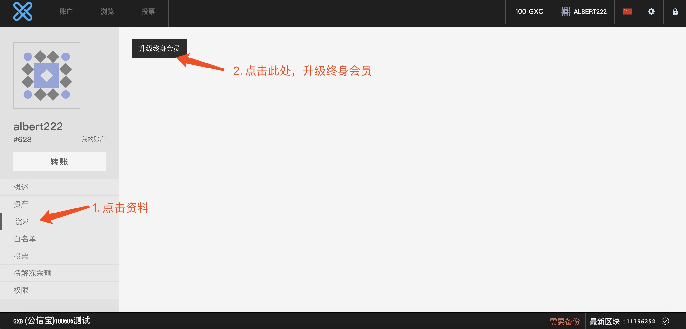
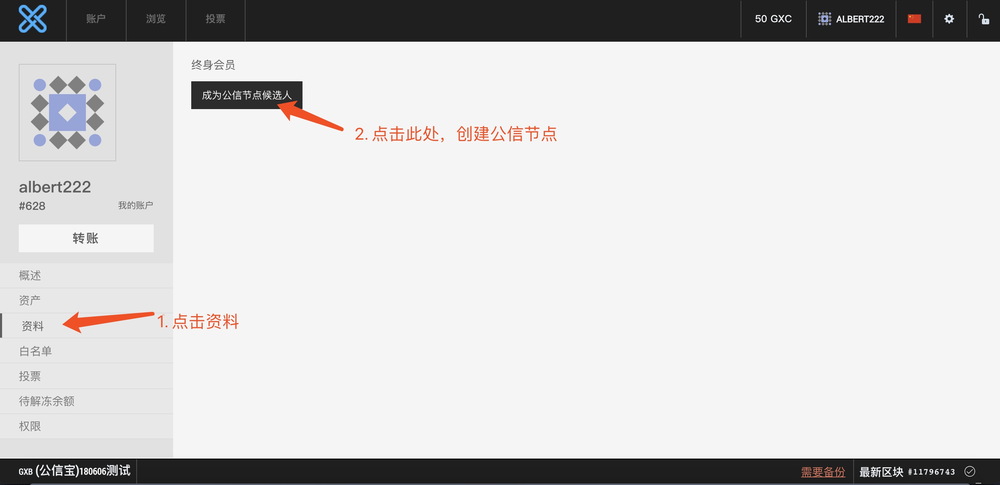

# 测试网络

## 介绍
测试网络是GXChain的外部测试环境，参数与主链相同。 测试网络的程序安装包是专用的，跟主网不同， 不能用主网的程序跑测试网络。

在测试网络上，开发者可以:

- 申请[免费的Token](http://blockcity.mikecrm.com/2SVDb67)
- 测试网络Token自动申领, 每次200个，每天1000个, 浏览器访问  http://testnet.gxchain.org:8088/get_token?your_account_name 
- 测试[客户端](clients.html)
- 体验最新功能
- 参与GXChain开发
- 项目开发，合约调试

| 测试网络 | 配置 |
| :-- | :-- |
| 接入点 *(在测试网络钱包中已内置)* | wss://testnet.gxchain.org |
| 种子节点 *(在节点启动时候指定)* | testnet.gxchain.org:6789 |
| 智能合约编译服务 *(在IDE中配置)* | https://testnet.gxx.gxchain.org |
| 区块浏览器 | https://testnet.explorer.gxchain.org |
| 在线钱包 | https://testnet.wallet.gxchain.org |
| 水龙头 | https://testnet.faucet.gxchain.org |

::: tip 提示
社区开发者贡献节点可以加入测试网络，申请成为公信节点。
:::

## 环境要求

- 系统: **Ubuntu 14.04 LTS 64-bit**, **4.4.0-63-generic** 内核 或者  **macOS 系统**
- 内存: 2GB+ (越多越好)
- 硬盘: 40GB+
- 网络： 10MB+带宽

::: warning 依赖安装

* 安装ntp
``` bash
sudo apt-get install ntp
```

* 安装libstdc++-7-dev
```bash
apt-get update
apt-get install software-properties-common
add-apt-repository ppa:ubuntu-toolchain-r/test
apt-get update
apt-get install libstdc++-7-dev
```
:::


## 1. 注册账户

访问测试网络[在线钱包](https://testnet.wallet.gxchain.org/#/) 注册钱包帐户

## 2. 申领测试Token

注册完成后, 点击[申领测试代币](http://blockcity.mikecrm.com/2SVDb67)

## 3. 下载最新testnet专用的节点程序

[**最新程序**](https://github.com/gxchain/gxb-core/releases/latest)

测试网络的程序，跟主网不同，需要单独下载，执行如下命令：

```bash
# 执行这个shell脚本，会自动从github下载最新的测试网程序，并解压至当前目录下
curl 'https://raw.githubusercontent.com/gxchain/gxb-core/dev_master/script/gxchain_testnet_install.sh' | bash
```

## 4. 下载测试网络genesis.json

```bash
wget http://gxb-package.oss-cn-hangzhou.aliyuncs.com/gxb-core/genesis/testnet-genesis.json -O genesis.json
```

::: tip 关于genisis.json
- genisis.json即创世文件
- 每一条链都有唯一的genesis.json
- genesis.json中指定了创世区块所必须的配置信息和节点启动的初始化参数
- 任意一个字符的改变，都会得到一个不同的chain_id
- 不同的chain_id将导致无法和seed_node之间相互通讯
- 因此：**请勿改变genisis.json**，除非你想跑一条[私有链](/zh/guide/private_chain)
:::

## 5. 启动测试网络节点， 同步数据

```bash
./programs/witness_node/witness_node --data-dir=testnet_node --rpc-endpoint="0.0.0.0:28090" --p2p-endpoint="0.0.0.0:9999" --seed-nodes='["testnet.gxchain.org:6789"]' --genesis-json genesis.json &
```

::: tip 参数介绍
- --data-dir指定区块数据存储路径
- --rpc-endpoin 开启rpc服务
- --p2p-endpoint 开启p2p监听服务
- --seed-nodes 指定节点启动时连接的种子节点
:::

目前测试网络数据量不大，可以跑全节点。通过后台日志文件testnet\_node/logs/witness.log可查看区块同步进度， 等待区块同步完成。
当区块编号以 10000 递增时，表示区块正在同步。当区块编号以 1 递增时，表示区块同步完成，GXChain整个测试链的数据约在1.5G左右，一个小时之内就可以同步完成。
```
2018-11-11T12:58:54        th_a:?unnamed?       reset_p2p_node ] Adding seed node 106.14.180.117:6789			application.cpp:152
2018-11-11T12:58:54        th_a:?unnamed?       reset_p2p_node ] Configured p2p node to listen on 0.0.0.0:8659			application.cpp:194
2018-11-11T12:58:54        th_a:?unnamed? reset_websocket_serv ] Configured websocket rpc to listen on 0.0.0.0:38067			application.cpp:269
2018-11-11T12:58:54        th_a:?unnamed?       plugin_startup ] data transaction plugin startup			data_transaction_plugin.cpp:63
2018-11-11T12:58:54        th_a:?unnamed?       plugin_startup ] witness plugin:  plugin_startup() begin			witness.cpp:121
2018-11-11T12:58:54        th_a:?unnamed?       plugin_startup ] No witnesses configured! Please add witness IDs and private keys to configuration.		witness.cpp:137
2018-11-11T12:58:54        th_a:?unnamed?       plugin_startup ] witness plugin:  plugin_startup() end			witness.cpp:138
2018-11-11T12:58:54        th_a:?unnamed?                 main ] Started witness node on a chain with 0 blocks.			main.cpp:216
2018-11-11T12:58:54        th_a:?unnamed?                 main ] Chain ID is c2af30ef9340ff81fd61654295e98a1ff04b23189748f86727d0b26b40bb0ff4			main.cpp:217

...

2018-11-11T13:02:14 th_a:invoke handle_block         handle_block ] Got block: #960000 time: 2018-01-17T18:44:30 latency: 25726664888 ms from: init3  irreversible: 959990 (-10)			application.cpp:496
2018-11-11T13:02:16 th_a:invoke handle_block         handle_block ] Got block: #970000 time: 2018-01-18T03:12:09 latency: 25696207587 ms from: init2  irreversible: 969992 (-8)			application.cpp:496
2018-11-11T13:02:18 th_a:invoke handle_block         handle_block ] Got block: #980000 time: 2018-01-18T11:39:39 latency: 25665759432 ms from: init10  irreversible: 979992 (-8)			application.cpp:496

...

2018-11-10T05:47:51 th_a:invoke handle_block         handle_block ] Got block: #8749837 time: 2018-11-10T05:47:51 latency: 33 ms from: init5  irreversible: 8749822 (-15)			application.cpp:496
2018-11-10T05:47:54 th_a:invoke handle_block         handle_block ] Got block: #8749838 time: 2018-11-10T05:47:54 latency: 36 ms from: init6  irreversible: 8749823 (-15)			application.cpp:496
2018-11-10T05:47:57 th_a:invoke handle_block         handle_block ] Got block: #8749839 time: 2018-11-10T05:47:57 latency: 30 ms from: miner8  irreversible: 8749824 (-15)			application.cpp:496

...

```
区块同步完成后，可以运行命令行钱包cli\_wallet。

## 6. 如何成为测试网的公信节点

#### (1) 升级为终身会员
创建公信节点，首先需要升级为终身会员。

下载最新版本的PC钱包，或者访问[网页钱包](https://wallet.gxb.io), 按下图操作，升级为终身会员。



::: warning 提示
只有终身会员才可以创建公信节点候选人，升级终身会员需要燃烧 50GXC 矿工费，请确保帐户余额充足。

:::

#### (2) 创建公信节点
按下图操作，创建公信节点。



#### (3) 查看公信节点id
按下图操作，查看公信节点id。


::: warning 提示
创建公信节点完成后，查看自己的节点id, 在启动公信节点程序时，需要带上此参数

:::

#### (4) 重新启动公信节点程序

重新启动公信节点程序，需要先关闭原来的witness_node

执行如下命令，关闭witness_node程序：
```
kill -s SIGTERM $(pgrep witness_node)
```

重新启动命令：
```
# 通过PC钱包或者网页钱包，查看自己的公信节点id
# 需要将如下的1.6.10 替换为自己的公信节点id, 将--private-key的参数值替换为自己的公信节点帐户的公私钥, 用于签署区块
./programs/witness_node/witness_node --data-dir=testnet_node \
--rpc-endpoint="0.0.0.0:28090" --p2p-endpoint="0.0.0.0:9999" \
--seed-nodes='["testnet.gxchain.org:6789"]' --genesis-json genesis.json  -w '"1.6.10"' \
--private-key '["GXC73Zyj56MHUEiCbWfhfJWjXAUJafGUXmwGeciFxprU5QEv9mhMU", "5Jainounrsmja4JYsgEYDQxpNYmMj98FRVSPhz2R7Pg8yaZh9Ks"]' &
```

其中
```
--data-dir指定区块数据存储路径

-w 指定的是自己的公信节点id
--private-key指定的是自己帐户的公钥和私钥
以上2个参数必须正确，否则将影响区块生产

&表示程序后台运行
```


::: tip 建议
将程序启动命令行，放入shell脚本，方便启动和停止。 脚本可参考[这里](https://github.com/gxcdac/gxchain-script/tree/master/gxchain-test-script)

```
#!/bin/bash
set -x

kill -s SIGINT $(pgrep witness_node)
echo $?

while true
do
	pid=$(pgrep witness_node)
	if [ $pid ] ; then
		echo "stop witness_node ..."
		sleep 1
	else
		break
	fi
done
echo "start witness_node ..."

./programs/witness_node/witness_node --data-dir=testnet_node \
--rpc-endpoint="0.0.0.0:28090" --p2p-endpoint="0.0.0.0:9999" \
--seed-nodes='["testnet.gxchain.org:6789"]' --genesis-json genesis.json  -w '"1.6.10"' \
--private-key '["GXC73Zyj56MHUEiCbWfhfJWjXAUJafGUXmwGeciFxprU5QEv9mhMU", "5Jainounrsmja4JYsgEYDQxpNYmMj98FRVSPhz2R7Pg8yaZh9Ks"]' \
--fast-replay  &
```
:::
