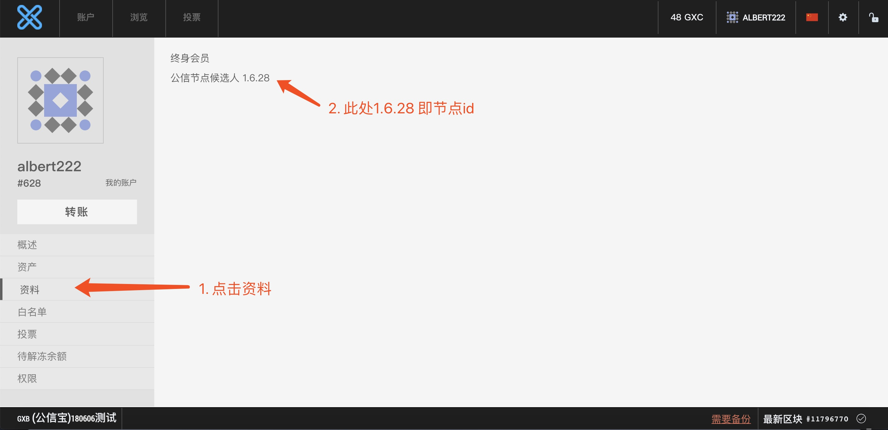

# 如何成为并启动一个公信节点

本文档介绍了如何在GXChain网络中成为一个公信节点。

## 流程简介

1. 通过公信宝钱包，创建公信节点
2. 部署并运行公信节点程序

### 1.创建公信节点

#### 升级为终身会员
创建公信节点，首先需要升级为终身会员。

下载最新版本的PC钱包，或者访问[网页钱包](https://wallet.gxb.io), 按下图操作，升级为终身会员。


::: warning 提示
只有终身会员才可以创建公信节点候选人，升级终身会员需要燃烧 50GXC 矿工费，请确保帐户余额充足。

:::

#### 创建公信节点
按下图操作，创建公信节点。


#### 查看公信节点id
按下图操作，查看公信节点id。



::: warning 提示
创建公信节点完成后，查看自己的节点id, 在启动公信节点程序时，需要带上此参数

:::

### 2.部署并启动公信节点程序
#### 环境要求

- 系统: **Ubuntu 14.04 64-bit**, **4.4.0-63-generic** 以上内核
- 内存: 32 GB+
- 硬盘: 200 GB+

::: warning 依赖安装

* 安装ntp
``` bash
sudo apt-get install ntp
```

* 安装libstdc++-7-dev
```bash
# Ubuntu系统需要安装
apt-get update
apt-get install software-properties-common
add-apt-repository ppa:ubuntu-toolchain-r/test
apt-get update
apt-get install libstdc++-7-dev
```

:::


下载节点程序
```
# 执行如下命令行，将下载最新的公信节点程序，到当前目录下
curl 'https://raw.githubusercontent.com/gxchain/gxb-core/dev_master/script/gxchain_install.sh' | bash
```

启动公信节点程序

```
# 通过PC钱包或者网页钱包，查看自己的公信节点id
# 需要将如下的1.6.10 替换为自己的公信节点id, 将--private-key的参数值替换为自己的公信节点帐户的公私钥, 用于签署区块
./programs/witness_node/witness_node --data-dir=trusted_node -w '"1.6.10"' \
--private-key '["GXC73Zyj56MHUEiCbWfhfJWjXAUJafGUXmwGeciFxprU5QEv9mhMU", "5Jainounrsmja4JYsgEYDQxpNYmMj98FRVSPhz2R7Pg8yaZh9Ks"]' &
```

其中
```
--data-dir指定区块数据存储路径

-w 指定的是自己的公信节点id
--private-key指定的是自己帐户的公钥和私钥
以上2个参数必须正确，否则将影响区块生产

&表示程序后台运行
```

完全同步区块需要约24小时。可以通过后台日志文件witness\_node\_data\_dir/logs/witness.log可查看区块同步进度，访问[GXChain区块浏览器](https://block.gxb.io/)查看最新区块。

通过tail -f trusted_node/log/witness.log查看日志。
如果当选为活跃公信节点，可以看到类似如下生成区块的日志：

```
Generated block #367 with timestamp 2017-08-05T20:46:30 at time 2017-08-05T20:46:30
```

### 3.查看公信节点出块奖励
如果当选为活跃公信节点，每打包一个区块，都会有对应的GXC奖励。 区块奖励会存入帐户的待解冻余额，需要主动申领，可以通过PC钱包或网页钱包查看并申领奖励。


